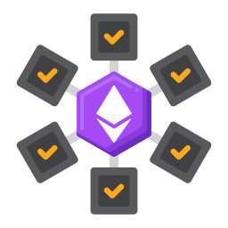

## Hello 👋, I'm Admong D!

 
 

I am a versatilist and easily adapt to different hats (Full Stack Web Developer 🌐, App Developer 📱, ML Engineer 🤖) depending on what the project requires. I love exploring new tech stack 💻 and leveraging them to build cool stuffs 🛠️. 
 
 
 

  
### 🧐 More About Me:

- 🔭 &nbsp; I’m currently working on **CrowdBotics**
- 🤝 &nbsp; I’m looking to collaborate on [sheets-database](https://github.com/rahul-jha98/sheets-database)
- 🌱 &nbsp; I’m currently learning Typescript; 
- 👨🏻‍💻 &nbsp; Most of my projects are available on [Github](https://github.com/Adhiccup?tab=repositories)
- 🎨 &nbsp; Using [this svg](https://storyset.com/illustration/javascript-frameworks/amico) and Figma I made 👉
- 💬 &nbsp; Ask me about anything tech related, I am happy to help;
- 📫 &nbsp; Feel free to ping me on [Skype](https://join.skype.com/invite/qheQtk8cWKgD)
- 📝 &nbsp; Checkout my [resume](https://drive.google.com/)

 
 
 
 

### 🔨 Languages and Tools:
 
 

 
 
 
 
 
 
 
 

### 📊 Github Stats

 

### 🛠️ My Projects

